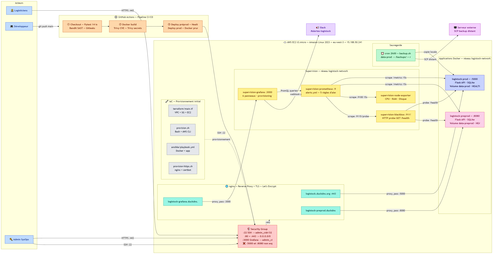

# Projet LogiStock — Administrateur Systèmes DevOps — Niveau 6 (EU)

Application de gestion d'inventaire pour la PME fictive LogiStock, réalisée dans le cadre de la certification RNCP Titre Professionnel Administrateur Systèmes DevOps — Niveau 6.

**Candidat :** Bergson Jean-Michel Sanvi AQUEREBURU — École iT — Session Septembre 2026

---

## Architecture globale



**Flux de haut en bas :**
1. Le développeur fait un `git push main` → déclenche GitHub Actions (11 étapes DevSecOps)
2. Terraform provisionne VPC + Security Group + EC2 ; Ansible installe Docker + Compose + nginx
3. nginx reçoit les requêtes HTTPS :443 (`logistock.duckdns.org` / Let's Encrypt) et reverse-proxie vers `api-prod:5000`
4. Prometheus scrape les 5 cibles toutes les 15s ; Grafana affiche 6 panneaux et envoie les alertes vers Slack via 5 règles Prometheus

---

## Stack technique

| Composant        | Technologie                                          |
|------------------|------------------------------------------------------|
| Application      | Python 3.13 / Flask / SQLite                         |
| Conteneurisation | Docker + Docker Compose v2.24.0                      |
| Reverse proxy    | nginx + Let's Encrypt (HTTPS :443)                   |
| CI/CD            | GitHub Actions — 11 étapes DevSecOps                 |
| Sécurité SAST    | Bandit (-lll -iii) + Gitleaks                        |
| Sécurité image   | Trivy (CVE CRITICAL/HIGH + secrets)                  |
| IaC              | Terraform (VPC + SG + EC2) + Ansible                 |
| Cloud            | AWS EC2 t3.micro Free Tier — eu-west-3 (Paris)       |
| OS serveur       | Amazon Linux 2023                                    |
| Supervision      | Prometheus + Grafana + node-exporter + blackbox-exporter |
| Alertes          | 5 règles Prometheus → Alertmanager → Slack (#alertes-logistock) |
| Sauvegarde       | Script Bash + crontab 2h00 — rotation 7j             |

---

## Structure du projet

```
projet-logistock/
├── .github/
│   └── workflows/
│       └── main.yml              ← Pipeline CI/CD DevSecOps (11 étapes)
│
├── app.py                        ← API Flask (routes, métriques Prometheus)
├── test_app.py                   ← 15 tests automatisés (Pytest)
├── Dockerfile                    ← Image python:3.13-slim + HEALTHCHECK + apt-get upgrade
├── requirements.txt              ← Dépendances : flask, prometheus_client
│
├── docker-compose.yml            ← 6 services : prod, préprod, prometheus,
│                                    grafana, node-exporter, blackbox-exporter
├── prometheus.yml                ← Configuration scraping (5 jobs, 15s)
├── alerts.yml                    ← 5 règles d'alerte Prometheus
├── grafana/
│   └── provisioning/
│       ├── dashboards/
│       │   └── logistock.json    ← Dashboard exporté (6 panneaux)
│       ├── datasources/
│       │   └── prometheus.yml    ← Datasource Prometheus auto-provisionné
│       └── alerting/
│           ├── contact-points.yaml        ← Webhook Slack
│           └── notification-policies.yaml ← Règles d'envoi alertes
│
├── nginx/
│   └── logistock.conf            ← Configuration reverse proxy HTTPS
│
├── backup.sh                     ← Sauvegarde automatique SQLite (rotation 7j)
├── provision.sh                  ← Provisionnement initial via Bash + AWS CLI
├── provision-https.sh            ← Installation nginx + certbot Let's Encrypt
│
├── terraform/
│   └── main.tf                   ← IaC — VPC + Security Group + EC2
└── ansible/
    └── playbook.yml              ← Configuration serveur : Docker + Compose
```

---

## Prérequis

- Compte AWS avec AWS CLI configuré (`aws configure`)
- Git + compte GitHub
- Clé SSH générée localement (voir section déploiement)
- Docker installé sur la machine locale (pour les tests)

---

## Déploiement de l'infrastructure

| Approche | Fichier | Statut |
|---|---|---|
| Script Bash + AWS CLI | `provision.sh` | Utilisé en production pour ce projet |
| Infrastructure as Code | `terraform/main.tf` | Alternative IaC standard (recommandée en équipe) |

La configuration du serveur (Docker, docker-compose) est gérée par Ansible (`ansible/playbook.yml`). L'activation HTTPS est gérée par `provision-https.sh` (nginx + certbot).

---

### Option A — Bash (utilisé en production)

```bash
# 1. Générer et importer la clé SSH
ssh-keygen -t rsa -b 2048 -f logistock-ssh-key.pem -N ""
aws ec2 import-key-pair \
  --key-name logistock-ssh-key \
  --region eu-west-3 \
  --public-key-material fileb://logistock-ssh-key.pem.pub

# 2. Provisionnement via script
chmod +x provision.sh && ./provision.sh

# 3. Configuration du serveur via Ansible
ansible-playbook -i <IP_EC2>, -u ec2-user --private-key logistock-ssh-key.pem ansible/playbook.yml
```

---

### Option B — Terraform + Ansible (IaC standard)

```bash
cd terraform/
terraform init
terraform apply -var admin_cidr="<TON_IP>/32"

ansible-playbook -i <IP_EC2>, -u ec2-user --private-key ../logistock-ssh-key.pem ../ansible/playbook.yml
```

---

## Pipeline CI/CD — 11 étapes DevSecOps

Le pipeline se déclenche automatiquement à chaque push sur `main`. **Si une étape échoue, le déploiement est bloqué.**

| # | Étape | Outil | Bloquant |
|---|---|---|---|
| 1 | Checkout du code source | actions/checkout | — |
| 2 | Tests automatisés | Pytest (15 cas) | Oui |
| 3 | Analyse SAST Python | Bandit (-lll -iii) | Oui |
| 4 | Détection de secrets Git | Gitleaks | Oui |
| 5 | Build de l'image Docker | docker build | Oui |
| 6 | Scan CVE image | Trivy (CRITICAL/HIGH) | Oui |
| 7 | Scan secrets image | Trivy secrets | Oui |
| 8 | Déploiement préprod | SSH → port 8080 | Oui |
| 9 | Health check préprod | curl /health → HTTP 200 | Oui |
| 10 | Déploiement prod | SSH → port 5000 | Oui |
| 11 | Nettoyage images | docker image prune | Non |

**15 runs réalisés — dernier run vert ✅**

**Secrets GitHub requis :**
- `AWS_HOST_IP` : adresse IP publique de l'EC2
- `AWS_SSH_KEY` : contenu de la clé privée PEM
- `SLACK_WEBHOOK_URL` : webhook Grafana → Slack

---

## Services Docker — 6 conteneurs

| Service | Port | Rôle |
|---|---|---|
| api-prod | :5000 | Flask Production — CRUD articles EPI |
| api-preprod | :8080 | Flask Préprod — validation CI/CD avant mise en prod |
| prometheus | interne | Collecte métriques toutes les 15s — 5 jobs |
| grafana | :3000 | Dashboard 6 panneaux + alertes Slack |
| node-exporter | interne | Métriques système CPU / RAM / Disque |
| blackbox-exporter | interne | HTTP probe /health → `probe_success` |

---

## Supervision

### Prometheus — 5 cibles de scrape

- `logistock-prod` → métriques Flask production (:5000/metrics)
- `logistock-preprod` → métriques Flask préprod (:8080/metrics)
- `node-exporter` → métriques système (:9100)
- `prometheus` → auto-supervision
- `blackbox-exporter` → sondage HTTP /health → génère `probe_success`

### Grafana — 6 panneaux

| Panneau | Type | Valeur observée |
|---|---|---|
| CPU (%) | Gauge | 1,35 % |
| RAM (%) | Gauge | 73,3 % |
| Disque (%) | Gauge | 58,1 % |
| Requêtes HTTP total | Stat | 1 187 requêtes |
| Latence moyenne (s) | Time series | 0,0003 s — courbes prod + préprod |
| Latence P95 | Time series | 9,5 ms — SLA < 500 ms respecté |

**Accès Grafana :**
- Public : https://logistock-grafana.duckdns.org
- Direct admin : http://15.188.50.241:3000
- Identifiants : `admin` / `Admin`

### 5 règles d'alerte Prometheus

| Alerte | Condition | Délai | Sévérité | Slack |
|---|---|---|---|---|
| APIIndisponible | `probe_success` == 0 | 1 min | critical | Oui |
| CPUEleve | CPU > 80% | 5 min | warning | Non |
| RAMElevee | RAM > 85% | 5 min | warning | Non |
| DisquePlein | Disque > 90% | 0 min | critical | Oui |
| LatenceElevee | P95 > 500ms | 5 min | warning | Non |

---

## Sauvegarde automatique

```bash
# Vérifier le crontab
crontab -l
# → 0 2 * * * /home/ec2-user/backup.sh

# Tester manuellement
/home/ec2-user/backup.sh && cat /home/ec2-user/backups/backup.log
```

- Rotation : 7 dernières sauvegardes conservées
- Fenêtre de restauration : 7 jours
- Durée de restauration : < 30 secondes

---

## API — Endpoints

| Méthode | Route | Description |
|---|---|---|
| GET | `/` | Interface web — tableau des articles avec filtres |
| GET | `/api/articles` | Liste tous les articles (JSON) |
| POST | `/api/articles` | Ajoute un article |
| PUT | `/api/articles/<id>` | Modifie un article |
| DELETE | `/api/articles/<id>` | Supprime un article |
| GET | `/health` | Health check (pipeline + Grafana) |
| GET | `/metrics` | Métriques Prometheus |

---

## Procédures opérationnelles

### Rollback

**Via Git (recommandé)**
```bash
git revert HEAD
git push origin main
# → GitHub Actions redéploie automatiquement la version stable
```

**Manuel sur le serveur**
```bash
ssh -i logistock-ssh-key.pem ec2-user@15.188.50.241
docker images | grep logistock
docker-compose stop api-prod
docker tag logistock-api:<VERSION_STABLE> logistock-api:latest
docker-compose up -d api-prod
curl http://localhost:5000/health
```

### Restauration de sauvegarde

```bash
docker-compose stop api-prod
cp /home/ec2-user/backups/inventaire_YYYYMMDD_HHMMSS.db \
   /home/ec2-user/projet-logistock/data-prod/inventaire.db
docker-compose start api-prod
curl https://logistock.duckdns.org/health
```

### Vérification quotidienne (< 2 min)

```bash
docker ps --format "table {{.Names}}\t{{.Status}}"  # conteneurs actifs ?
ls -lh /home/ec2-user/backups/ | tail -5             # dernière sauvegarde OK ?
df -h /                                              # espace disque suffisant ?
```

---

## Liens

- **Application (prod)** : https://logistock.duckdns.org
- **Application (préprod)** : https://logistock-preprod.duckdns.org
- **Grafana** : https://logistock-grafana.duckdns.org
- **GitHub** : github.com/Bergson26/projet-logistock
